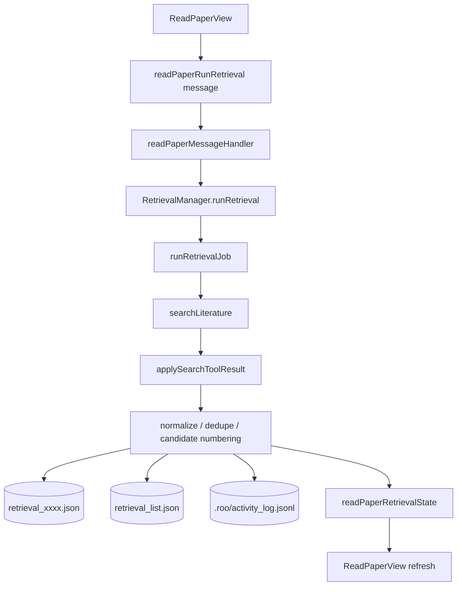
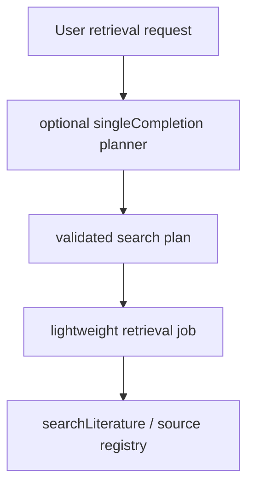

# ReadPaper 重构方案与当前状态

> 目标：把 ReadPaper 固定为一个 `workspace-configurable`、确定性执行的文献检索工作区。检索闭环由后端 job 完成；AI 只作为 optional planner，用于把自然语言 request 翻成英文 query / search plan，不承担 task 编排、交互、保存或入库。
> 更新时间：2026-05-20。

## 1. 当前结论

`legacy_task` 分支已经从目标架构中移除。ReadPaper retrieval 是一个闭环操作，不需要完整 `Task` 的多轮互动、审批、completion 回写和 task history 语义。

当前主链路是：

```text
ReadPaper UI -> RetrievalManager -> searchLiterature() -> normalize / dedupe -> retrieval asset -> optional import
```

当前检索原则：

```text
Web search for recall, scholarly APIs for truth.
```

`scholarly_plus_web_discovery` 只表示请求 web discovery 作为 recall layer；网页结果不能直接作为最终文献事实来源。最终 candidate 仍依赖 DOI、identifier、Crossref、OpenAlex、Semantic Scholar、DBLP、arXiv、IEEE Xplore 等结构化 metadata 验证。当前实现先落地 strategy、provenance 和 confidence/evidence 字段，不做 page scraping。

当前 ReadPaper UI 已按 workspace shell 方向收敛：左侧是 module / session 导航，`Retrieval` 是可切换的 session 列表，`Literature Library` 和 `Literature Map` 先保留为 draft module，`Settings` 负责 workspace defaults。这样可以把后续的 library / map 能力挂在同一个 shell 里，而不是继续扩展单页 retrieval 表单。

`execution_mode` 只保留：

```text
lightweight_job
```

旧 asset 中如果出现 `legacy_task`，schema 会在读取时归一化为 `lightweight_job`，只用于兼容历史数据，不再提供执行分支。

## 2. 已落地能力

本阶段已经覆盖：

- `workspace config`：`.roo/config/readpaper.json`。
- ReadPaper 专用 schema：`packages/types/src/readpaper.ts`。
- retrieval schema 扩展：planner profile、actual result count、shortfall、source registry version。
- 默认 `lightweight_job`：后端直接调用 `searchLiterature()`。
- 删除 `legacy_task` 后端分支和 `retrievalAgentPrompt` task prompt。
- ReadPaper control messages：配置读取/更新、创建/保存/运行、删除、确认/归档、candidate / retrieval 入库。
- `LiteratureManager` 入库映射与去重。
- `ReadPaperView` workspace shell UI：module nav、retrieval sessions、workspace defaults、library/map drafts。
- optional AI planner，且已经用于英文翻译和 search plan 生成。
- retrieval strategy：`scholarly_only` / `scholarly_plus_web_discovery`。
- candidate evidence：`existence_confidence`、`relevance_confidence`、`verified_sources`、`discovery_sources`、`match_evidence`。
- source registry 已扩展到 `pubmed`、`arxiv`、`semantic-scholar`、`crossref`、`openalex`、`dblp`、`ieee-xplore`、`acm-dl`。
- 候选摘要完整展示。
- icon-only controls 使用 `StandardTooltip` 和 `aria-label`。

尚未落地：

- 多轮 `quota fill` / pagination 补检。
- `europe-pmc` 等进一步 academic databases。
- 批量选中 candidate 入库。
- 单独的用户使用文档和完整检索原理文档。

## 3. 当前架构



optional planner 的目标位置：



planner 只允许输出结构化 English search plan，必须通过 schema 校验。它不调用 tool、不写文件、不导入 library，也不允许直接把中文 request 送去 searchLiterature。`searchLiterature()` 底层也会拒绝含中文的 `query`，作为防止中文直搜的最后一层 guard。

## 4. Workspace Config

配置文件：

```text
.roo/config/readpaper.json
```

当前 shape：

```json
{
	"schema_version": "1.0",
	"planner_profile_id": "",
	"planner_profile_name": "",
	"execution_mode": "lightweight_job",
	"default_sources": ["pubmed", "arxiv"],
	"default_max_results": 20,
	"default_year_from": null,
	"default_year_to": null,
	"default_import_target": "literature_library"
}
```

原则：

- 不保存 API key。
- `execution_mode` 固定为 `lightweight_job`。
- `planner_profile_id` 只为后续 optional planner 预留。
- source registry 当前支持 `pubmed`、`arxiv`、`semantic-scholar`、`crossref`、`openalex`、`dblp`、`ieee-xplore`、`acm-dl`，类型层、runtime 和 UI 保持一致。
- 默认 source 仍是 `pubmed` + `arxiv`，避免一次普通检索默认打到过多公共 API；用户可以在 Defaults 或 Current retrieval 中勾选更多数据库。

## 5. 数据模型

`packages/types/src/retrieval.ts` 当前包含：

- `execution_mode`
- `planner_profile_id`
- `planner_profile_name`
- `actual_total_results`
- `shortfall`
- `source_registry_version`
- `last_run_at`
- `last_completed_at`
- `last_error_at`
- `retrieval_strategy`
- `existence_confidence`
- `relevance_confidence`
- `verified_sources`
- `discovery_sources`
- `match_evidence`

`readPaperExecutionModeSchema` 只接受 `lightweight_job`，但会把历史 `legacy_task` 输入迁移成 `lightweight_job`。

## 6. 后端职责

`RetrievalManager` 负责：

- 初始化 `.roo/literature/retrievals/`。
- 初始化 `.roo/config/readpaper.json`。
- 创建、更新、运行 retrieval。
- 删除 retrieval 文件并更新 `retrieval_list.json`。
- 调用 `searchLiterature()`。
- 应用 search result。
- 标准化、去重、编号 candidate。
- 记录 `actual_total_results` 和 `shortfall`。
- 写入 `.roo/activity_log.jsonl`。
- 调用 `LiteratureManager` 完成 candidate / retrieval 入库。

已经移除：

- `provider.createTask()`。
- `retrievalAgentPrompt.ts`。
- task listener。
- completion JSON 回写。
- ReadPaper task 对 `search_literature` 的特殊绕过逻辑。

## 7. 前端职责

`ReadPaperView` 当前负责：

- workspace shell 导航：`Retrieval` / `Literature Library` / `Literature Map` / `Settings`。
- `Retrieval` session history 和当前 session。
- workspace planner profile 配置。
- 显示固定 execution mode：`lightweight_job`。
- 默认 source、max results、year range 配置。
- 默认 retrieval strategy 配置。
- create / save / run retrieval。
- confirm / archive / delete retrieval。
- confirm / exclude / import candidate。
- import retrieval。
- full abstract display。
- candidate confidence / evidence display。
- run summary display。
- Library / Map draft surface。

## 8. 后续路径

### Phase 2：搜索引擎与补检

- source registry 已具备 shared source 列表、UI options 和 runtime adapter，后续补分页与 quota fill。
- 增加 pagination / exhausted 状态。
- 实现 `quota fill`。
- 记录 shortfall reason。

### Phase 3：optional AI planner（已实现）

- 使用 `singleCompletionHandler` 或等价 lightweight completion。
- 使用 `planner_profile_id` 选择 model profile。
- planner 输出 `ReadPaperSearchPlan`，并先翻译成英文再生成 executable query / keywords。
- planner 输出必须经过 Zod 校验。

### Phase 4：academic databases 扩展

已接入 source：

- `semantic-scholar`
- `crossref`
- `openalex`
- `dblp`
- `ieee-xplore`
- `acm-dl`

后续候选 source：

- `europe-pmc`
- `scopus` / `web-of-science`，仅在用户有机构授权和合规 API access 时考虑。

要求类型层、runtime、UI 和文档同步更新。

## 9. 相关文件

- `packages/types/src/readpaper.ts`
- `packages/types/src/retrieval.ts`
- `packages/types/src/vscode-extension-host.ts`
- `src/services/literature/RetrievalManager.ts`
- `src/services/literature/LiteratureManager.ts`
- `src/core/tools/SearchLiteratureTool.ts`
- `src/core/webview/readPaperMessageHandler.ts`
- `src/core/webview/webviewMessageHandler.ts`
- `webview-ui/src/context/ExtensionStateContext.tsx`
- `webview-ui/src/components/read-paper/ReadPaperView.tsx`
