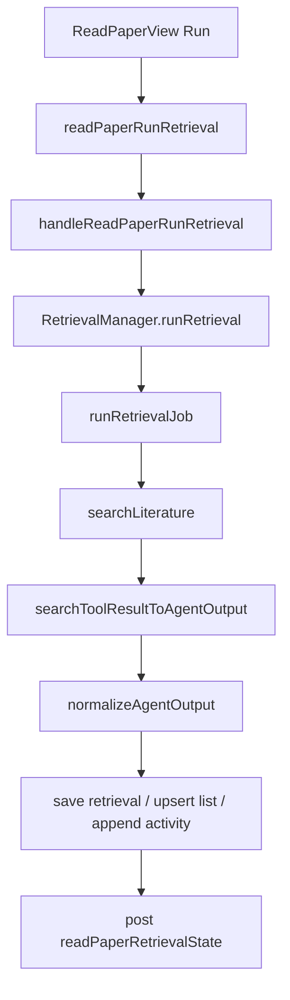
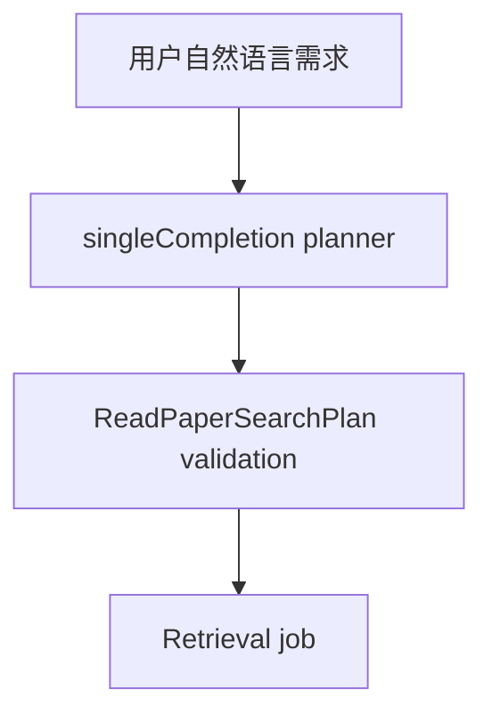

# ReadPaper Retrieval 技术方案

> 本文描述当前 ReadPaper retrieval 实现。名词、字段名和代码概念保留英文，解析性说明使用中文。

## 1. Goal

ReadPaper retrieval 的目标是把一次文献检索变成可复现、可追踪、可管理的 retrieval asset。

用户在 ReadPaper panel 中输入自然语言需求、可执行 query、source、年份范围和筛选标准。系统创建或更新 `retrieval_xxxx.json`，运行后把 PubMed、arXiv、Semantic Scholar、Crossref、OpenAlex、DBLP、IEEE Xplore、ACM DL metadata 返回的候选文献写回 retrieval asset。用户可以继续确认、排除、归档、删除 history，也可以把 candidate 导入 literature library。

当前执行模式固定为：

```text
lightweight_job
```

旧 `legacy_task` 数据会被 schema 归一化为 `lightweight_job`。运行时不再创建内部 task。

在实际运行前，后端会先把用户的自然语言 request 翻译成英文 search plan：

- 优先通过 `singleCompletionHandler` 产出英文 `query` 和 `search_keywords`。
- `query` 必须是可执行的 academic database query。
- `search_keywords` 也必须是英文关键词或短语。
- 识别 `近两年`、`近三年` 这类时间描述并折算成 `year_from` / `year_to`。
- 如果 planner 不可用，后端只会回退到 English-only heuristic fallback，不会把中文直接送去 `searchLiterature()`。

当前 retrieval strategy 有两种：

- `scholarly_only`：只使用结构化 scholarly APIs 作为检索和验证来源。
- `scholarly_plus_web_discovery`：允许请求 web discovery 作为 recall layer，但网页结果只作为发现线索；最终 candidate 仍必须由 scholarly APIs / DOI / identifier metadata 验证。当前实现先记录该 strategy 和 unavailable 状态，不进行 page scraping。

## 2. Scope

Included：

- 创建和更新 retrieval asset。
- ReadPaper workspace config。
- ReadPaper workspace shell UI：module nav、retrieval sessions、Settings、Library、Map draft panels。
- 直接执行 `searchLiterature()`。
- optional AI planner 英文翻译和 search plan 生成。
- source registry 支持 `pubmed`、`arxiv`、`semantic-scholar`、`crossref`、`openalex`、`dblp`、`ieee-xplore`、`acm-dl`。
- candidates 内联保存到 `retrieval_xxxx.json`。
- 使用 Zod schema 校验 retrieval、candidate 和 workspace config。
- 当前 retrieval 内去重。
- 最多保存 200 个 candidates。
- 记录 `actual_total_results`、`shortfall` 和 `source_registry_version`。
- 写入 retrieval provenance 和 activity log。
- 支持 candidate confirm / exclude。
- 支持 retrieval confirm / archive / delete。
- 支持单条 candidate 入库和整次 retrieval 入库。
- ReadPaper UI 展示完整 abstract。

Excluded：

- 内部 `Task` 执行。
- `retrievalAgentPrompt`。
- completion JSON 回写。
- `europe-pmc` 等进一步 academic databases。
- source pagination 和自动补检。
- PDF download / PDF parsing。
- cross-retrieval deduplication。
- automatic inclusion / exclusion screening。

## 3. Source Registry

当前 source registry 版本为 `1.2`。

| Source             | 定位                                            | 当前接入方式                                    | 主要返回字段                                                                          |
| ------------------ | ----------------------------------------------- | ----------------------------------------------- | ------------------------------------------------------------------------------------- |
| `pubmed`           | Biomedical / life sciences 权威检索             | NCBI E-utilities `esearch` + `efetch`           | title、authors、year、venue、DOI、PMID、abstract、keywords                            |
| `arxiv`            | Preprint 检索                                   | arXiv Atom API                                  | title、authors、year、venue、DOI、arXiv id、abstract、categories                      |
| `semantic-scholar` | 跨学科 metadata 与 semantic ranking             | Semantic Scholar Graph API `paper/search`       | title、authors、year、venue、DOI、PMID、arXiv id、abstract、url                       |
| `crossref`         | Publisher DOI metadata                          | Crossref REST API `/works`                      | title、authors、year、container title、DOI、abstract、subjects                        |
| `openalex`         | Open scholarly graph                            | OpenAlex `/works` search                        | title、authors、year、venue、DOI、abstract、keywords、topics、url                     |
| `dblp`             | Computer science bibliography                   | DBLP publication search API                     | title、authors、year、venue、DOI、record url、publication type                        |
| `ieee-xplore`      | Electronics / communications / engineering / CS | IEEE Xplore API                                 | title、authors、year、publication title、article number、DOI、abstract、keywords、url |
| `acm-dl`           | ACM computer science publication metadata       | Crossref `/works` with ACM DOI prefix `10.1145` | title、authors、year、container title、DOI、abstract、subjects                        |

默认 source 仍为 `pubmed` + `arxiv`。这是为了让普通检索保持响应稳定，并减少公共 API rate limit 风险。用户可以在 Defaults 或 Current retrieval 中额外勾选 `semantic-scholar`、`crossref`、`openalex`、`dblp`、`ieee-xplore`、`acm-dl`。

Semantic Scholar 支持可选环境变量 `SEMANTIC_SCHOLAR_API_KEY` 或 `S2_API_KEY`。未配置时仍使用公开 API；如果触发 rate limit，该 source 会以 `error` 记录到 `search_provenance.runs` 和 `result_summary.errors`，不阻断其他 source 返回结果。

IEEE Xplore 需要环境变量 `IEEE_XPLORE_API_KEY` 或 `IEEE_API_KEY`。未配置时 `ieee-xplore` 会返回该 source 的 `error`，不会阻断其他 source。ACM DL 当前通过 Crossref 的 ACM DOI prefix 做 metadata 检索，不访问 ACM DL 页面、不下载全文。

所有 source-specific record id 统一保存到 candidate 的 `source_id`。例如 IEEE Xplore 的 `article_number` / `arnumber`、DBLP 的 `key`、OpenAlex work id、Crossref / ACM metadata DOI 都会尽量写入该字段。

## 4. Asset Layout

```text
.roo/
  config/
    readpaper.json
  activity_log.jsonl
  literature/
    library.json
    retrievals/
      retrieval_list.json
      retrieval_0001.json
      retrieval_0002.json
```

## 5. Workspace Config

```json
{
	"schema_version": "1.0",
	"planner_profile_id": "",
	"planner_profile_name": "",
	"execution_mode": "lightweight_job",
	"default_retrieval_strategy": "scholarly_only",
	"default_sources": ["pubmed", "arxiv"],
	"default_max_results": 20,
	"default_year_from": null,
	"default_year_to": null,
	"default_import_target": "literature_library"
}
```

字段含义：

- `planner_profile_id`：optional planner 未来要使用的 provider profile id。
- `planner_profile_name`：profile 展示名。
- `execution_mode`：固定为 `lightweight_job`。
- `default_retrieval_strategy`：默认检索策略，当前支持 `scholarly_only` / `scholarly_plus_web_discovery`。
- `default_sources`：新建 retrieval 的默认 source。
- `default_max_results`：新建 retrieval 的默认目标数量。
- `default_year_from` / `default_year_to`：默认年份范围。
- `default_import_target`：当前固定为 `literature_library`。

## 6. States

Retrieval states：

```text
未确认 / 已确认 / 已归档
```

Candidate states：

```text
候选 / 已确认 / 已排除 / 冲突 / 错误
```

Run status：

```text
idle / running / completed / error / aborted
```

## 7. Retrieval Asset Shape

```json
{
	"schema_version": "1.0",
	"retrieval_no": "retrieval_0001",
	"title": "Transformer EEG literature search",
	"Q": "检索 Transformer 在 EEG 分类中的应用",
	"date": "2026-05-20",
	"state": "未确认",
	"execution_mode": "lightweight_job",
	"retrieval_strategy": "scholarly_plus_web_discovery",
	"planner_profile_id": "",
	"planner_profile_name": "",
	"query": "(transformer OR attention) AND EEG AND classification",
	"search_keywords": ["transformer", "attention", "EEG", "classification"],
	"search_sources": ["pubmed", "arxiv", "semantic-scholar", "crossref", "openalex", "dblp", "ieee-xplore", "acm-dl"],
	"max_results": 20,
	"year_from": 2020,
	"year_to": 2026,
	"search_provenance": {
		"summary": "Searched pubmed, arxiv, semantic-scholar, crossref, openalex, dblp, ieee-xplore, acm-dl for \"...\".",
		"runs": []
	},
	"result_summary": {
		"total_found": 20,
		"total_saved": 20,
		"by_source": {
			"pubmed": 10,
			"arxiv": 4,
			"semantic-scholar": 3,
			"crossref": 2,
			"openalex": 1,
			"dblp": 0,
			"ieee-xplore": 0,
			"acm-dl": 0
		},
		"duplicates_removed": 0,
		"errors": []
	},
	"candidates": [],
	"run_status": "completed",
	"actual_total_results": 20,
	"shortfall": 0,
	"source_registry_version": "1.2",
	"created_at": "2026-05-20T00:00:00.000Z",
	"updated_at": "2026-05-20T00:00:00.000Z",
	"last_run_at": "2026-05-20T00:00:00.000Z",
	"last_completed_at": "2026-05-20T00:00:00.000Z"
}
```

## 8. Candidate Shape

```json
{
	"candidate_no": "candidate_0001",
	"state": "候选",
	"source": "pubmed",
	"source_id": "",
	"source_rank": 1,
	"title": "",
	"authors": [],
	"year": null,
	"venue": "",
	"doi": "",
	"pmid": "",
	"arxiv_id": "",
	"url": "",
	"abstract": "",
	"keywords": [],
	"relevance_score": null,
	"relevance_reason": "",
	"existence_confidence": 0.98,
	"relevance_confidence": 0.74,
	"verified_sources": ["doi", "crossref"],
	"discovery_sources": ["web_discovery_requested"],
	"match_evidence": ["DOI 10.xxxx/yyyy", "venue IEEE Transactions on Antennas and Propagation"],
	"notes": "",
	"decision_reason": "",
	"metadata_warnings": []
}
```

## 9. Workflow



步骤：

1. 用户点击 Run。
2. 前端发送 `readPaperRunRetrieval`。
3. 后端先 update 或 create retrieval。
4. `RetrievalManager.runRetrieval()` 调用 `runRetrievalJob()`。
5. `validateRunnable()` 检查 query / Q / search_keywords 和 source。
6. `buildRetrievalSearchPlan()` 先把自然语言 request 翻成英文 executable query / keywords。
7. `searchLiterature()` 按 source registry 请求 PubMed / arXiv / Semantic Scholar / Crossref / OpenAlex / DBLP / IEEE Xplore / ACM DL metadata。
8. `applySearchToolResult()` 转换结果。
9. `normalizeAgentOutput()` 去重、编号、截断并生成 summary。
10. `buildCandidateEvidence()` 为 candidate 生成 `existence_confidence`、`relevance_confidence`、`verified_sources`、`discovery_sources` 和 `match_evidence`。
11. 写入 retrieval asset、index 和 activity log。
12. 前端收到 `readPaperRetrievalState` 后刷新。

source-level 的 `no_results`、`rate limit`、`missing API key` 等信息不再直接当成 retrieval 失败；它们会保存在 `search_provenance.runs` 中，UI 只把它们作为 source status / note 展示。真正的 retrieval 结果问题仍然会体现在 `result_summary.errors` 或 `run_status`。

## 10. Optional Planner

当前 optional planner 位于 job 前面，并且只负责英文计划生成：



planner 只输出 search plan，不执行检索、不写文件、不入库，也不允许把中文原句直接传给检索源。

## 11. Validation Rules

- Draft 可以没有 query。
- 执行时必须有 query、Q 或 search_keywords 之一。
- 执行时至少有一个 source。
- source 只能来自 `pubmed` / `arxiv` / `semantic-scholar` / `crossref` / `openalex` / `dblp` / `ieee-xplore` / `acm-dl`。
- `max_results` 必须是正整数，最大 200。
- 空结果允许，但必须写入 provenance 和 error，例如 `no_results_found`。
- full raw API response 不保存。
- candidate 去重只在当前 retrieval 内执行。
- 当用户输入自然语言 request 时，后端会先翻成英文，再生成 executable `query` / `search_keywords`，然后执行 `searchLiterature()`。
- 当 planner 不可用时，后端只会走 English-only heuristic fallback；如果仍然无法生成英文 query，会直接报错，不会直接中文直搜。
- `searchLiterature()` 底层也会拒绝含中文的 `query`，防止绕过 ReadPaper planner 直接中文检索。
- 当用户只填 `search_keywords` 时，后端也会把它们规范成英文并拼成可执行 query。
- `search_keywords` 主要用于 UI、说明和 plan trace，不作为单独的 task 分支。
- `scholarly_plus_web_discovery` 不允许直接把网页搜索结果当成最终文献；未配置 web discovery provider 时记录 `web_discovery_unavailable`。
- `existence_confidence` 表示文献记录真实性置信度；`relevance_confidence` 表示与用户主题匹配置信度，二者必须分开。

## 12. Activity Log

事件包括：

```text
create_retrieval
update_retrieval
run_retrieval_job
run_retrieval_job_invalid
run_retrieval_job_failed
search_tool_output_applied
search_tool_output_invalid
confirm_candidate
exclude_candidate
confirm_retrieval
archive_retrieval
delete_retrieval
import_candidate
import_retrieval
```

## 13. Import Workflow

单条入库：

```text
readPaperImportCandidate -> RetrievalManager.importCandidateToLibrary -> LiteratureManager.upsertReadPaperCandidate
```

整次入库：

```text
readPaperImportRetrieval -> RetrievalManager.importRetrievalToLibrary -> LiteratureManager.upsertReadPaperCandidate
```

去重规则：

1. DOI
2. PMID
3. arXiv id
4. title fuzzy

## 14. Implementation Files

- `packages/types/src/readpaper.ts`
- `packages/types/src/retrieval.ts`
- `packages/types/src/vscode-extension-host.ts`
- `src/services/literature/RetrievalManager.ts`
- `src/services/literature/LiteratureManager.ts`
- `src/core/tools/SearchLiteratureTool.ts`
- `src/core/webview/readPaperMessageHandler.ts`
- `src/core/webview/webviewMessageHandler.ts`
- `webview-ui/src/context/ExtensionStateContext.tsx`
- `webview-ui/src/components/read-paper/ReadPaperView.tsx`
