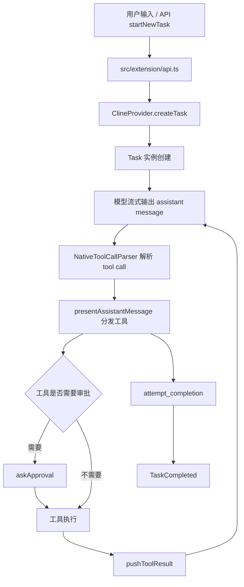
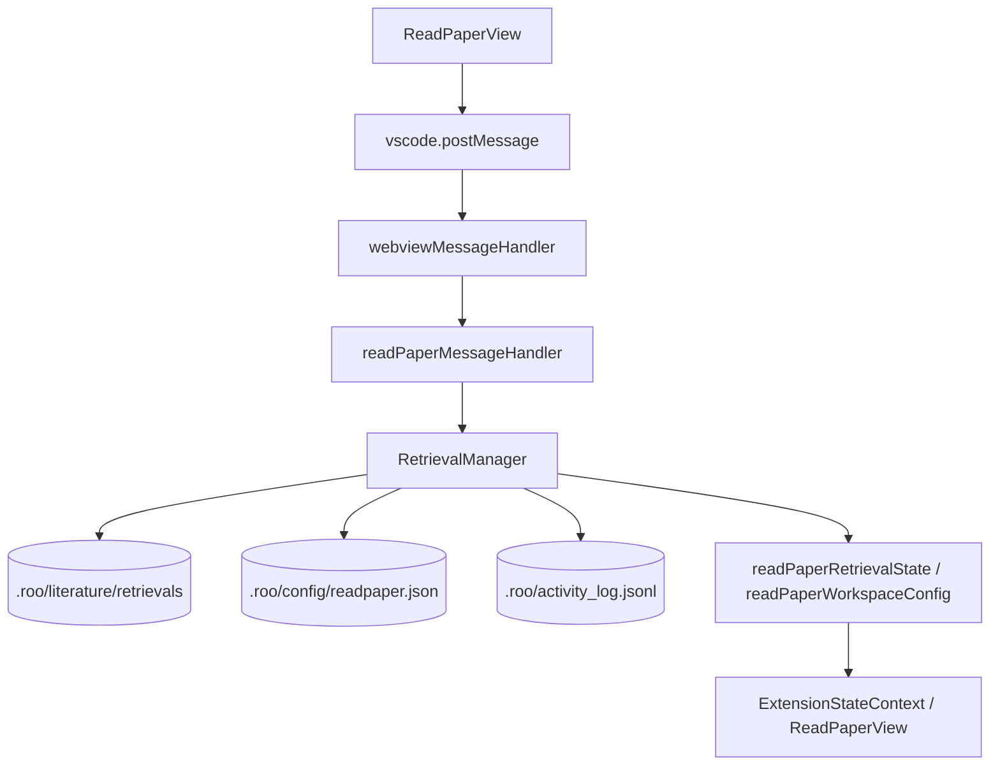
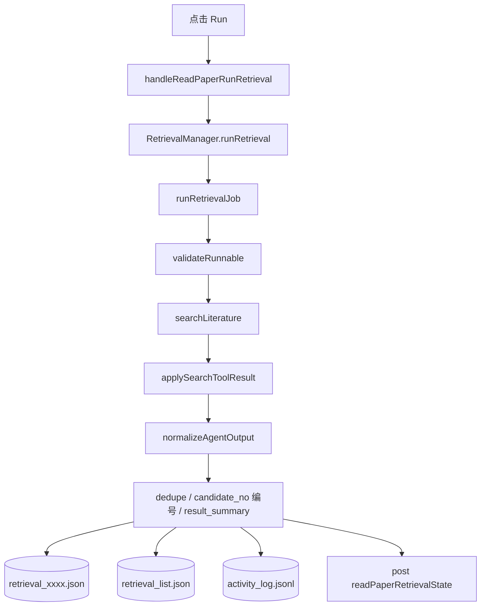
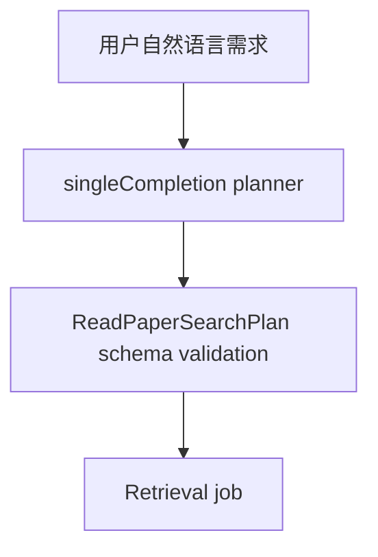
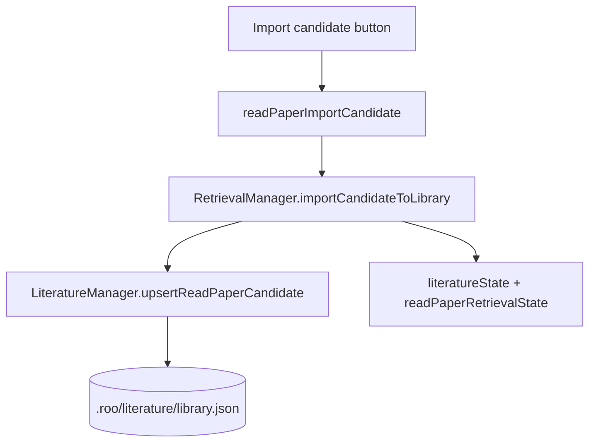

# 当前工具调用流程说明

> 适用范围：当前 `dev` 分支的实现。  
> 目的：把普通任务和 ReadPaper retrieval job 的调用链路拆开，说明当前工具是怎么被触发、执行、回写和持久化的。

## 1. 先看结论

当前项目里有两条相关链路：

1. 普通任务链路：用户在 Chat / API 中发起任务，模型在同一个 `Task` 上下文里调用通用工具，执行结果回到任务对话。
2. ReadPaper retrieval job 链路：用户在 ReadPaper 面板中运行 retrieval，后端直接调用 `searchLiterature()`，结果写回 retrieval asset。

ReadPaper 不再创建内部 `Task`，也不再使用 `retrievalAgentPrompt` 或 completion JSON 回写。文献检索是一个闭环 job，不需要 task interaction。

## 2. 普通任务完整流程

普通任务中的 `search_literature` 是普通 tool：

- 需要 approval。
- 结果作为 tool result 返回给模型。
- 不会自动写入 ReadPaper retrieval asset。

## 3. ReadPaper 控制面流程

ReadPaper 的前端操作不是模型 tool call，而是 webview control message。

当前 ReadPaper control messages：

- `readPaperListRetrievals`
- `readPaperGetWorkspaceConfig`
- `readPaperUpdateWorkspaceConfig`
- `readPaperResetWorkspaceConfig`
- `readPaperCreateRetrieval`
- `readPaperUpdateRetrieval`
- `readPaperRunRetrieval`
- `readPaperUpdateCandidate`
- `readPaperConfirmRetrieval`
- `readPaperArchiveRetrieval`
- `readPaperDeleteRetrieval`
- `readPaperImportCandidate`
- `readPaperImportRetrieval`

## 4. ReadPaper Retrieval Job 流程

实际顺序：

1. 用户在 `ReadPaperView` 编辑 retrieval 并点击 Run。
2. 前端发送 `readPaperRunRetrieval`。
3. 后端必要时先 create / update retrieval。
4. `RetrievalManager.runRetrieval()` 进入 `runRetrievalJob()`。
5. `validateRunnable()` 校验 query / Q 和 source。
6. `buildRetrievalSearchPlan()` 先把自然语言 request 翻成英文 executable query / keywords。
7. 直接调用导出的 `searchLiterature()`。
8. `applySearchToolResult()` 把 search result 转成 retrieval output 形状。
9. `normalizeAgentOutput()` 完成去重、candidate 编号、summary 生成。
10. 写入 retrieval 文件、列表索引和 activity log。
11. 推送 `readPaperRetrievalState`，前端刷新。

在当前实现里，`RetrievalManager` 会先尝试生成英文 search plan：

- `singleCompletionHandler` 会优先生成英文 `query` 和 `search_keywords`。
- 如果 planner 不可用或返回无效结果，后端会回退到 English-only heuristic fallback。
- `query` 如果还是自然语言 request，就会被重写成 executable academic database query。
- `search_keywords` 会自动补全，并且只保留英文关键词。
- `searchLiterature()` 自身也会拒绝含中文的 `query`，避免任何路径直接把中文 request 送到 academic databases。
- `near two years / 近两年` 这类描述会折算成 `year_from` / `year_to`。
- source 运行中的 `no_results`、`rate limit`、`missing API key` 会留在 `search_provenance.runs`，前端以 source status 呈现，不再直接当成 retrieval 级别错误。
- `retrieval_strategy` 决定是否请求 web discovery recall layer。`scholarly_plus_web_discovery` 只把 web discovery 当发现入口，最终 metadata 仍由 scholarly APIs / DOI / identifier 验证；当前不做 page scraping。
- 每个 candidate 会生成 `existence_confidence`、`relevance_confidence`、`verified_sources`、`discovery_sources` 和 `match_evidence`，用于区分“文献真实存在”和“与主题相关”。

这条链路不会创建 `Task`，也不会进入 `NativeToolCallParser` / `presentAssistantMessage`。

## 5. Optional Planner 位置

如果需要 AI，只作为 lightweight planner：

planner 只能做：

- Chinese request to English translation。
- query normalization。
- keywords extraction。
- source / year / max results planning。

planner 不能做：

- 调用 search tool。
- 创建 task。
- 保存 retrieval asset。
- 导入 literature library。

## 6. `search_literature` 当前契约

输入参数：

- `query`：必须是英文 executable academic database query；中文自然语言 request 需要先翻译和规范化。
- `retrieval_strategy`: `scholarly_only` / `scholarly_plus_web_discovery`
- `sources`: `pubmed` / `arxiv` / `semantic-scholar` / `crossref` / `openalex` / `dblp` / `ieee-xplore` / `acm-dl`
- `maxResults`
- `yearFrom`
- `yearTo`

输出结构：

- `status`
- `query`
- `sources`
- `maxResults`
- `yearFrom`
- `yearTo`
- `source_registry_version`
- `search_provenance`
- `result_summary`
- `candidates`

在普通任务中，结果返回给模型。  
在 ReadPaper retrieval job 中，结果由 `RetrievalManager.applySearchToolResult()` 写入 retrieval asset。

## 7. 入库调用流程

单条 candidate 入库：

整次 retrieval 入库：

去重规则：

- DOI
- PMID
- arXiv id
- title fuzzy

## 8. 当前边界

- optional planner 已接入，但只负责英文 search plan 生成。
- 结果不足只记录 `shortfall`，尚未自动补检。
- source registry 当前支持 `pubmed` / `arxiv` / `semantic-scholar` / `crossref` / `openalex` / `dblp` / `ieee-xplore` / `acm-dl`。
- 没有 PDF download / PDF parsing。
- 没有 automatic inclusion / exclusion screening。
- 没有跨 retrieval 去重。

## 9. 相关文件

- `src/extension/api.ts`
- `src/core/webview/ClineProvider.ts`
- `src/core/task/Task.ts`
- `src/core/assistant-message/NativeToolCallParser.ts`
- `src/core/assistant-message/presentAssistantMessage.ts`
- `src/core/tools/SearchLiteratureTool.ts`
- `src/core/webview/readPaperMessageHandler.ts`
- `src/core/webview/webviewMessageHandler.ts`
- `src/services/literature/RetrievalManager.ts`
- `src/services/literature/LiteratureManager.ts`
- `packages/types/src/readpaper.ts`
- `packages/types/src/retrieval.ts`
- `webview-ui/src/components/read-paper/ReadPaperView.tsx`
- `webview-ui/src/context/ExtensionStateContext.tsx`
